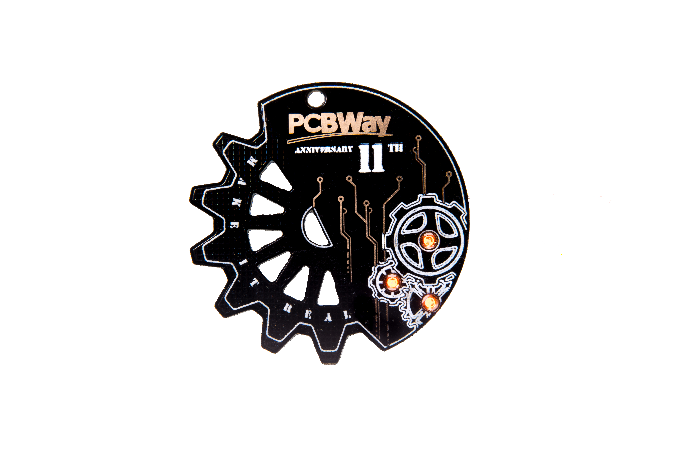

# PCBWay 11th Anniversary Badge – Breathing Light Edition

</a>

A commemorative multilayer PCB badge celebrating PCBWay’s 11th anniversary, featuring breathing LEDs, symbolic copper traces, and mechanical gears to represent the journey from idea to reality.

---

## 🛠️ Features

- **Gold-plated copper traces** mimicking real PCB routing
- **Mechanical gear design** symbolizing the mechanical side of product development
- **Breathing LED effect** using discrete electronics to simulate an idea coming to life
- **Multilayer structure** with decorative front and electronics integrated on the back

---

## 💡 Concept

This badge is a tribute to PCBWay’s role in enabling inventors to turn ideas into real, functional products. The glowing gears and traces represent the bridge between electrical engineering and mechanical creativity.

